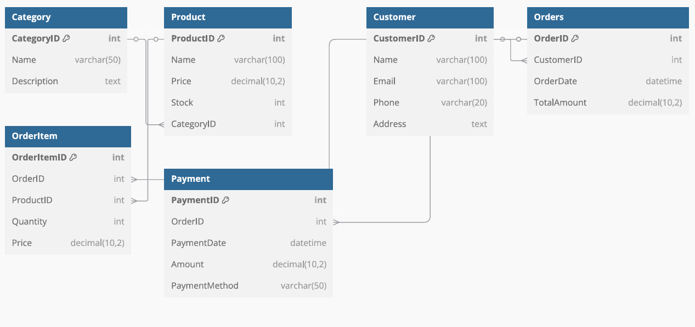

# 🛒 E-Commerce Database Schema – SQL Developer Internship Task 1

## 📌 Task Objective

Design and implement a relational database schema for an **E-commerce platform** using MySQL Workbench. This task involves:

- Defining entities and relationships
- Creating SQL tables with proper constraints
- Writing DDL scripts
- Visualizing the schema via an ER Diagram

---

## 🗂️ Chosen Domain

**E-Commerce System**  
Entities: Customer, Product, Category, Orders, OrderItem, Payment

---

## 🛠️ Tools Used

- MySQL Workbench (for writing and executing SQL)
- dbdiagram.io (for ER diagram generation)
- GitHub (for version control and submission)

---

## 🧱 Schema Design (Entities & Relationships)

- Each **Customer** can place multiple **Orders**
- Each **Order** has multiple **OrderItems**
- Each **OrderItem** maps to one **Product**
- Each **Product** belongs to one **Category**
- Each **Order** is linked to one **Payment**

---

## 🧾 SQL Script Included

The `TASK1_srivarshini.sql` file contains:
- `CREATE DATABASE` statement
- 6 tables with proper constraints:
  - `Customer`
  - `Category`
  - `Product`
  - `Orders`
  - `OrderItem`
  - `Payment`

---

## 🗺️ ER Diagram

ER Diagram was created using [dbdiagram.io](https://dbdiagram.io)

### Image:

---

## 📥 How to Run

1. Open **MySQL Workbench**
2. Open the `TASK1_srivarshini.sql` file
3. Run the script (F5)
4. Use the schema `ECommerceDB`

---

